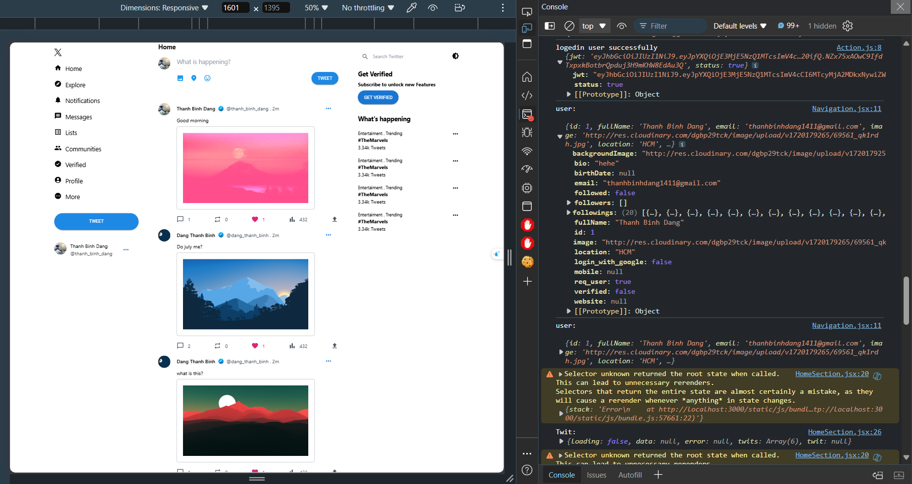
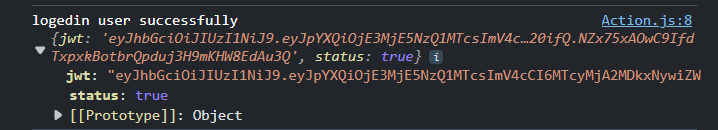
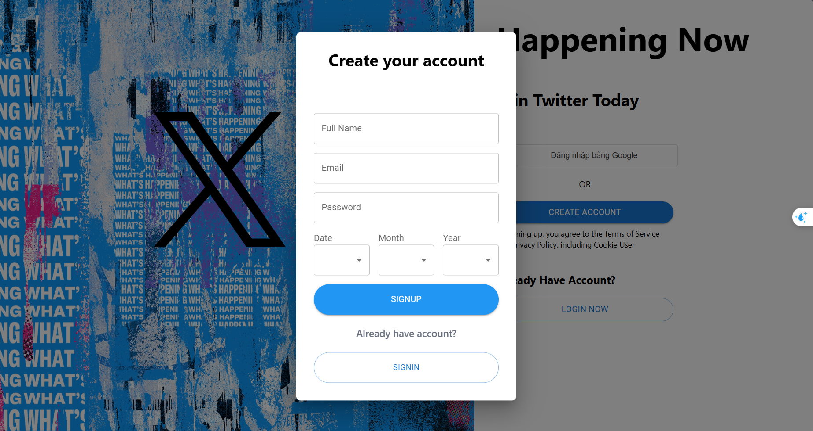
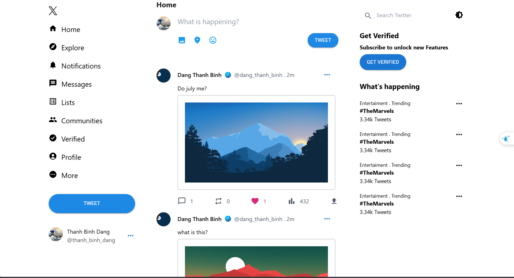
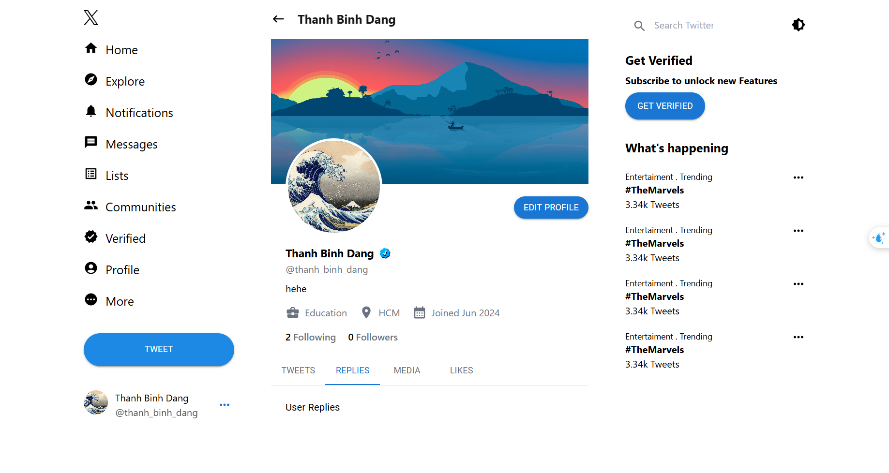
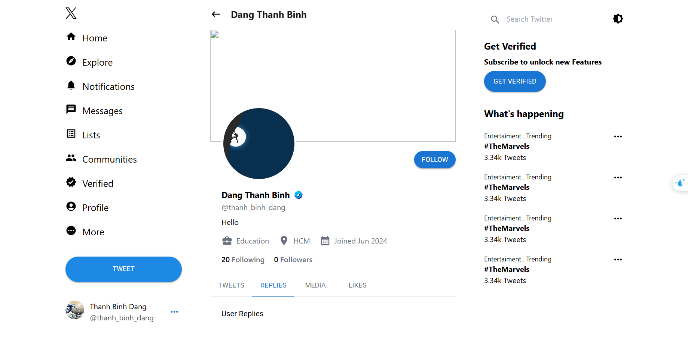
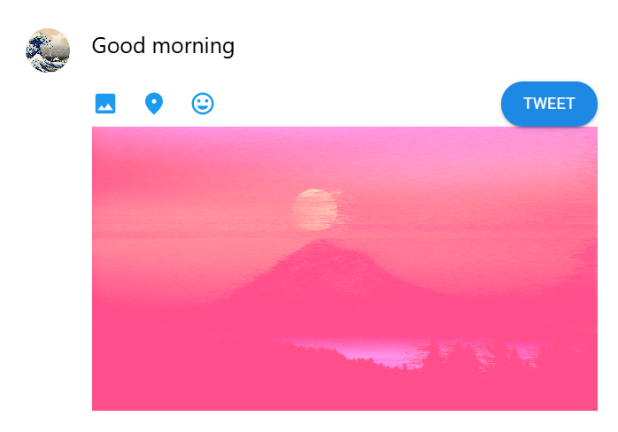
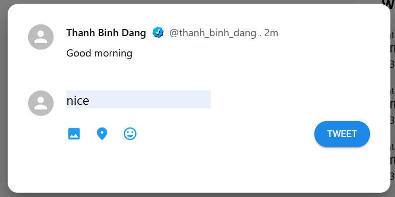
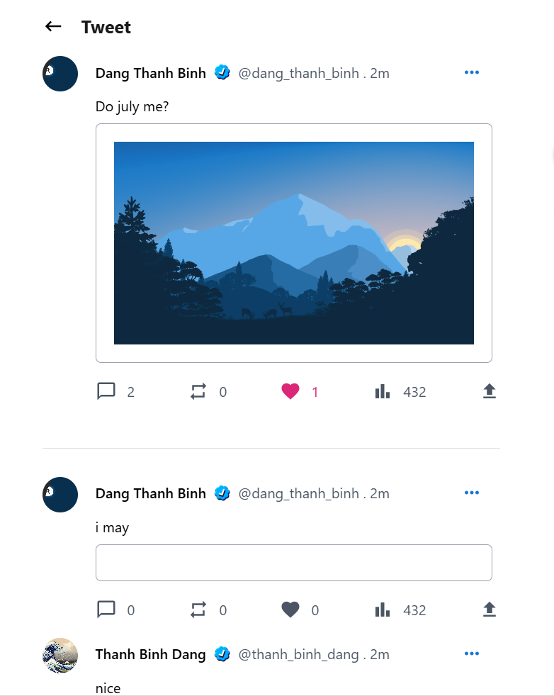

# Twitter Clone Web Application

## Mục Lục

- [Giới Thiệu](#giới-thiệu)
- [Công Nghệ Sử Dụng](#công-nghệ-sử-dụng)
- [Các Tính Năng](#các-tính-năng)

## Giới Thiệu

Dự án này là một ứng dụng web clone Twitter với các tính năng chính bao gồm xác thực người dùng, hồ sơ người dùng, đăng tweet, theo dõi/bỏ theo dõi và thích tweet.

## Công Nghệ Sử Dụng

- **Frontend**: ReactJS
- **Backend**: Spring Boot
- **Database**: MySQL
- **Authentication**: JWT (JSON Web Tokens)
- **Styling**: Material UI

## Các Tính Năng

- User Authentication 
  - JWT (JSON Web Token) is used during login to authenticate users.
  
  
- Create account
  
- Home page
  
- User Profile
  
  
- Post tweet
  
- Reply tweet
  
- Tweet detail
  
- Follow/Unfollow
- Likes

